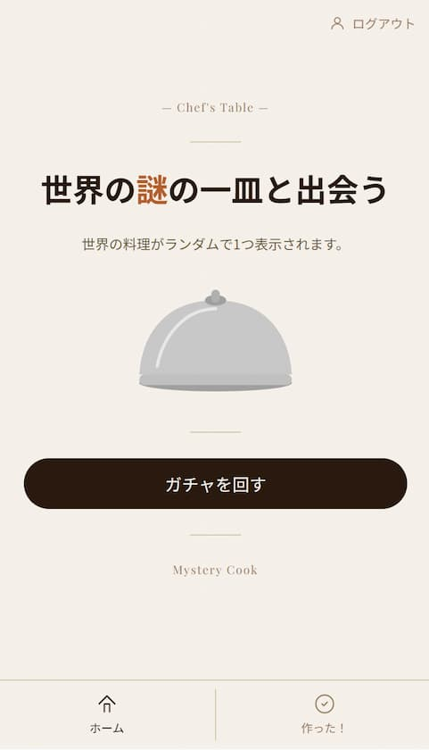

# Mystery Cook


[](https://open.vscode.dev/keisukessu/Mystery-cook)
[](https://github.com/keisukessu/Mystery-cook/actions/workflows/backend-tests.yml) [](https://github.com/keisukessu/Mystery-cook/actions/workflows/frontend-tests.yml)

<div style="text-align: center;">
  <span style="font-size: 1.25rem; font-weight: bold;">
    Mystery Cook
  </span>
  - 世界の未知の料理に出合う -
</div>


## デモ

**本番URL**：https://mystery-cook.vercel.app


<!--  -->


## 機能・特徴

- 🎲 **料理ガチャ** — ガチャを回して世界の未知の料理がランダムで出現
- 🍳 **「作った！」記録** — 作った料理を記録・一覧表示
- 🔍 **ソート機能** — 作った日・料理名・国名・難易度で並び替え
- 🔐 **認証** — メール/パスワード + Google ログイン対応
- 🤖 **AI生成レシピ** — Claude API (Haiku) によるレシピ自動生成
- 🖼️ **料理画像** — Unsplash API による料理画像の自動取得


## 技術スタック

| 領域 | 技術 |
|---|---|
| フロントエンド | Next.js 16 / TypeScript / Tailwind CSS |
| バックエンド | FastAPI / Python 3.12 |
| データベース | PostgreSQL 16 |
| 認証 | NextAuth.js |
| AI | Claude API (Haiku) |
| 画像 | Unsplash API |
| インフラ | Vercel / Render |
| CI/CD | GitHub Actions |


## セットアップ

### 必要なもの

- Docker / Docker Compose
- Node.js 20以上
- Claude API キー
- Unsplash API キー

### バックエンド・DB の起動

```bash
git clone https://github.com/keisukessu/Mystery-cook.git
cd Mystery-cook/Mystery-cook
docker compose up -d db backend
```

### フロントエンドの起動

```bash
cd frontend
npm install
npm run dev
```

ブラウザで http://localhost:3000 を開く。


## 環境変数

### バックエンド（`Mystery-cook/backend/.env`）

```env
DATABASE_URL=postgresql+asyncpg://gacha:gacha_pass@db:5432/mystery_cook
SECRET_KEY=your_secret_key
CLAUDE_API_KEY=your_claude_api_key
UNSPLASH_ACCESS_KEY=your_unsplash_access_key
```

### フロントエンド（`Mystery-cook/frontend/.env.local`）

```env
NEXT_PUBLIC_API_URL=http://localhost:8000
NEXTAUTH_URL=http://localhost:3000
NEXTAUTH_SECRET=your_nextauth_secret
GOOGLE_CLIENT_ID=your_google_client_id
GOOGLE_CLIENT_SECRET=your_google_client_secret
```


## テスト

### バックエンド

```bash
cd Mystery-cook/Mystery-cook
docker compose exec backend pytest -v
```

### フロントエンド

```bash
cd Mystery-cook/Mystery-cook/frontend
npm test
```


## API

| メソッド | エンドポイント | 説明 |
|---|---|---|
| POST | `/api/v1/auth/register` | 新規登録 |
| POST | `/api/v1/auth/login` | ログイン |
| POST | `/api/v1/gacha/spin` | 料理ガチャを回す |
| GET | `/api/v1/user-dishes/` | 作った料理一覧 |
| POST | `/api/v1/user-dishes/` | 作った料理を記録 |